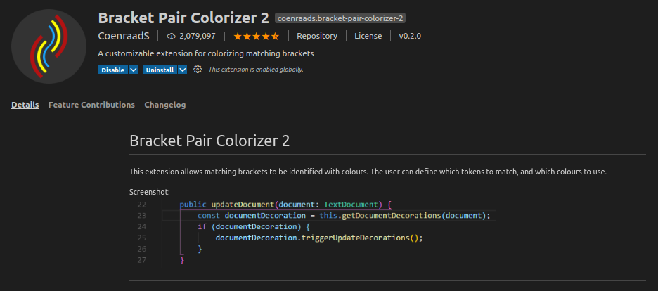
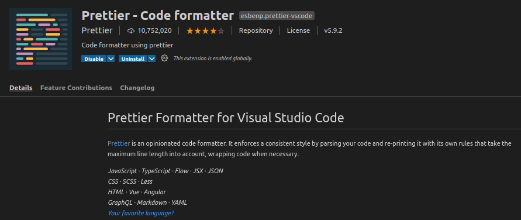
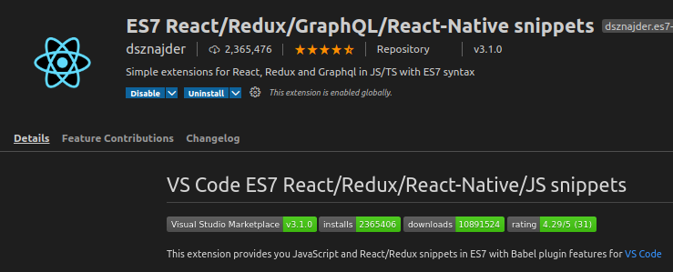
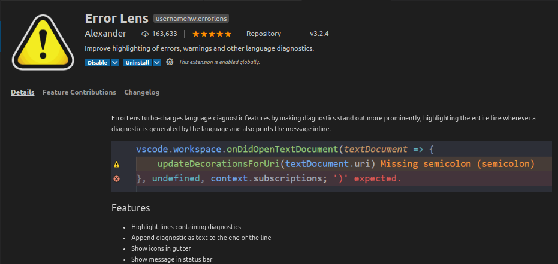
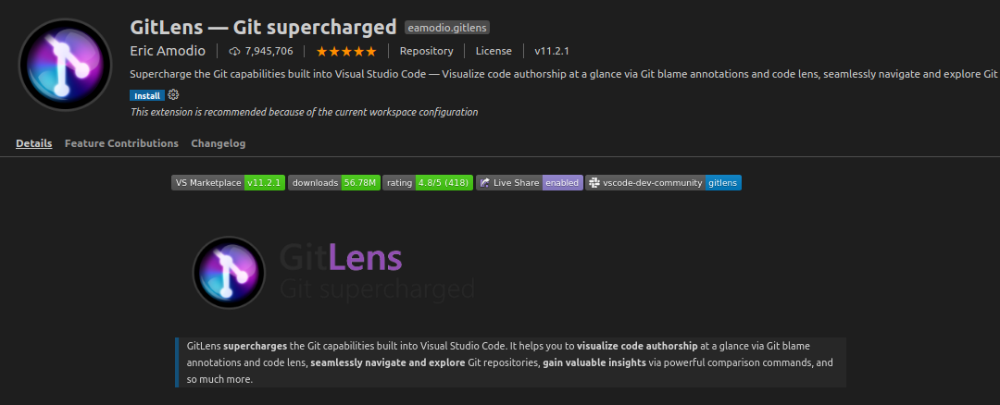
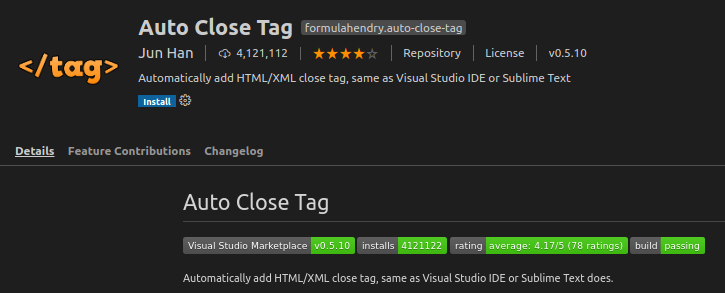
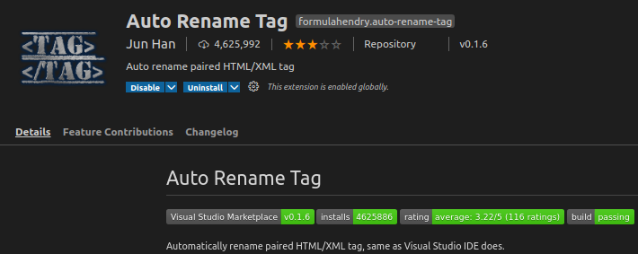
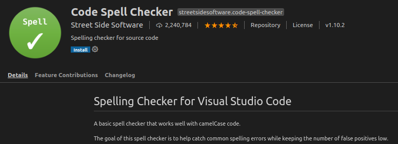
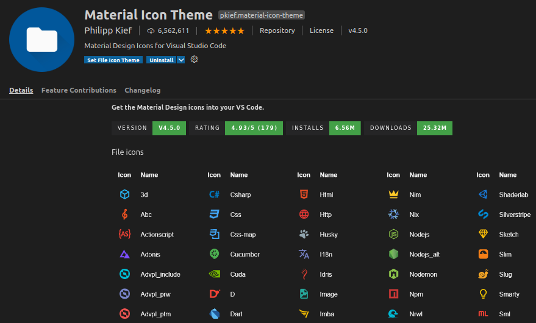
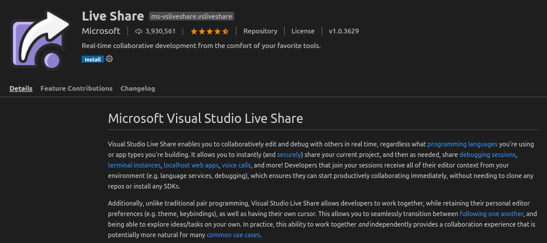

### Some of the Best VsCode editor extensions to Increase the Productivity

### 1. Bracket Pair Colorizer 2

### 2. Prettier - Code formatter

### 3. ES7 React/Redux/GraphQL/React-Native snippets

### 4. Error Lens

### 5. Git Lens
Gitlens is another great extension. It supercharges the current VSCode Git functionalities with the ability to perform side by side code comparison from your previous commits and changes, together with other features.

### 6. Auto Close Tag

### 7. Auto Rename Tag

### 8. Code Spell Checker

### 9. Material Icon Theme
This extension gives you pretty, cute icons for your file list. If the file is a JavaScript then it will include a JavaScript icon in the material style beside the file name.
    

### 10. Live Share
Live share is one of the most advanced features in VSCode text editor. It’s perfect when working with team members. One of its functions is to allow every developer to share code snippets with other developers in real-time.

