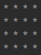
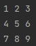
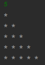
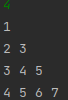
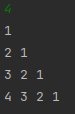
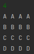
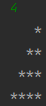
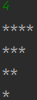
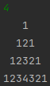
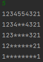

# Patterns

## 1. Square Star



```java
int i=0,j=0;
while (i<n){
	while(j<n){
	  System.out.print("* ");
    j++;
	  }
   j=0;
   i++;
   System.out.println("");
}
```

## 2. continues number matrix



```java
int k =1;
int i=0;
while(i<n){
	int j =0;
  while(j<n){
    System.out.print(k+" ");
    k++;
    j++;
    }
  System.out.println();
  i++;
}
```

## 3. Star triangle



```java
int row=1;
while(row<=n){
		int col =0;
    while(col<row){
	    System.out.print("* ");
      col++;
      }
     row++;
		System.out.println();
}
```

## 4.



```java
int count =1;
        int row=1;
        while(row<=n){
            int col =1;
            count=row;
            while(col<=row) {
                System.out.print(count + " ");
                col++;
                count++;
            }
            row++;
            System.out.println();
        }
```

## 5.



```java
				int row=1;
        while(row<=n){
            int col =1;
            count=row;
            while(col<=row) {
                System.out.print((row-col+1) + " ");
                col++;
            }
            row++;
            System.out.println();
        }
// n-j+1 for reverse printing
```

## 6.



```java
int row=1;
int col = 1;
while(row<=n){-
    while(col<=n) {
        char a =(char)('A'+ row - 1);
        System.out.print(a +" ");
        col++;
    }
    col=1;
    row++;
    System.out.println();
}
```

## 7.



```java
int row=1;
int col = 1;
while(row<=n){
		// print spaces
    while(col<=n-row){
        System.out.print(" ");
        col++;
    }
    col=1;
		// print * 
    while(col<=row) {
        System.out.print("*");
        col++;
    }
    col=1;
    row++;
    System.out.println();
}
```

## 8.



```java
int row=1;
int col = 1;
while(row<=n){
    while(col<=n-row+1) {
        System.out.print("*");
        col++;
    }
   col=1;
    row++;
    System.out.println();
}
```

## 9.



```java
int row=1;
int col = 1;
while(row<=n){
    //print space
    while(col<=n-row){
        System.out.print(" ");
        col++;
    }
    col=1;
    //print 1st triangle
    while(col<=row){
        System.out.print(col);
        col++;
    }
    //print 2nd triangle
    int start = row-1;
    while(start>0){
        System.out.print(start);
        start--;
    }
    col=1;
    row++;
    System.out.println();
}
```

## 10.



```java
int row=1;
int col = 1;
while(row<=n){
    while(col<=n-row+1){
        System.out.print(col);
        col++;
    }
    col=(row-1)*2;
    while(col>0){
        System.out.print("*");
        col--;
    }
    col=n-row+1;
    while(col>0){
        System.out.print(col);
        col--;
    }
    col=1;
    row++;
    System.out.println();
}
```
