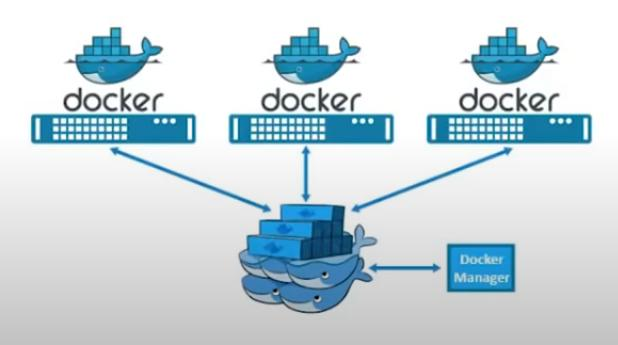

## Docker Swarm

Docker swarm is a technique to create and maintain a cluster of **Docker Engines**

**Service** deployed in any node can be accessed on other nodes in the same clusters

This command  creates a network of Docker engines/ hosts to execute containers in parallel (for scaling up &  high availability).

Docker Swarm is an **orchestration tool** like Kubernetes. 

Features: 

1. High-Availability of services
2. Auto load-balancing
3. Decentralised Access
4. Easy to Scale-up deployments



*Docker Swarm*

```bash
**docker swarm init --advertise-addr <IP_address_manager_machine> ->** #Initalize Swarm as a Manager node 
**docker swarm join <token> ->** # To join a swarm cluster as a worker node, token is given by the manager
**docker swarm join-token ->** # re-generate worker token at manager end
**docker swarm leave ->** # Leave the docker swarm cluster as a worker
**docker swarm leave --force ->** # Leave the docker swarm cluster as a manager
**docker node ps ->** # list services in nodes
**docker node rm <id> ->** # remove node
****
# Commands run on only Managers
**docker node ls ->** # list the nodes
	**# Docker Services are used to control any existing Docker Service (Container/ Compose/ Swarm/ Others ...)**
**docker service ls ->** #list services running in the cluster
**docker service ps <name> ->** # list nodes in which this service is running
**docker service scale <name>=5 ->** # scale services to increases replicas
**docker service create --name <name> <image-name> ->** # create new service
	**--mode global** -> # flag used to deploy service on all nodes
	**--replicas 2 ->** # Deploy service on only 2 nodes and manger will auto-decide the healthy nodes to deploy 
**docker service rm <name> ->** # remove service
**docker service stop
docker service logs**
```